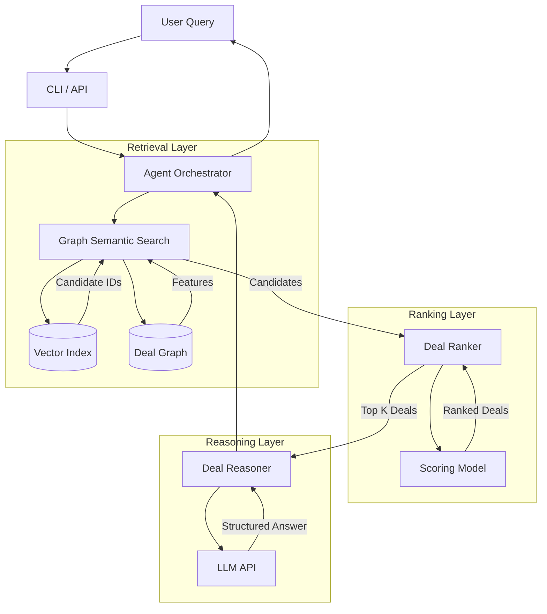
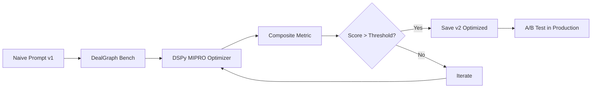

# Architecture - DealGraph Agent

## 1. System Overview

The **DealGraph Agent** is a Retrieval-Augmented Generation (RAG) system designed for private equity precedent analysis. It combines **semantic search** (vector embeddings) with **graph topology** (DealGraph) to retrieve and rank relevant historical deals before passing them to an LLM for reasoning.

## 2. Component Diagram



## 3. Data Model

We use Pydantic models for strict schema validation.

### Core Entities
*   **Deal**: A portfolio company investment.
    *   `sector_id`, `region_id`, `is_platform`, `status`
*   **Sector / Region**: Taxonomy nodes.
*   **Event**: Time-based actions (`addon`, `exit`).
*   **Snippet**: Textual evidence (news, case studies).

### Graph Schema
*   **Nodes**: Deal, Sector, Region, Event, Snippet.
*   **Edges**:
    *   `IN_SECTOR`: Deal -> Sector
    *   `IN_REGION`: Deal -> Region
    *   `ADDON_TO`: Deal -> Deal (Platform)
    *   `EXITED_VIA`: Deal -> Event
    *   `DESCRIBED_IN`: Deal -> Snippet

## 4. Ranking Strategy

### V1: Heuristic / ML Hybrid
The ranker produces a score $S$ for a candidate deal $d$ given query $q$:

$$ S(d, q) = \alpha \cdot \text{sim}(d, q) + \beta \cdot \text{graph\_score}(d) $$

Where:
*   $\text{sim}(d, q)$: Cosine similarity of embeddings.
*   $\text{graph\_score}(d)$: Feature vector (degree, sector match, etc.) processed by the model.

**Training Data Strategy (Option B)**:
We use a "Reverse-Query Generator". We sample deal clusters from the graph and use an LLM to hallucinate realistic user queries that *would* result in those deals, creating synthetic positive/negative pairs for training.

## 5. Technology Stack

*   **Language**: Python 3.10+
*   **Graph**: NetworkX (in-memory for V1)
*   **Vector Store**: In-memory numpy / FAISS
*   **LLM**: OpenAI API (or compatible)
*   **Prompt Optimization**: DSPy (MIPRO optimizer)
*   **CLI**: Typer

---

## 6. Prompt Management Architecture

### Versioning Strategy

Prompts are treated as first-class artifacts with semantic versioning (MAJOR.MINOR.PATCH):

```
prompts/
  deal_reasoner/
    v1_naive.txt           # Baseline hand-written prompt
    v2_optimized.json      # DSPy MIPRO-optimized
    CHANGELOG.md           # Version history with metrics
```

### Optimization Pipeline



**Composite Metric** (used by DSPy):
* 40%: Precision@3 for precedent selection
* 30%: Playbook quality (LLM-as-judge)
* 30%: Narrative coherence (LLM-as-judge)

### Runtime Behavior

1. **Load optimized prompt** (v2) if available
2. **Fall back to naive** (v1) if optimization hasn't run
3. **Fail loudly** on execution errors (no silent fallbacks)

---

## 7. Architecture Decision Records (ADRs)

### ADR-001: NetworkX for Graph Storage (V1)

**Status**: Accepted for V1, revisit for V2

**Context**: Need to store and traverse deal relationships (platform → add-ons, sector membership, etc.)

**Decision**: Use NetworkX in-memory graph for V1

**Rationale**:
* Fast prototyping - rich graph algorithm library
* Sufficient for synthetic dataset (<1000 nodes)
* Zero infrastructure overhead

**Limitations**:
* All in-memory: doesn't scale beyond ~10K nodes
* No persistence: rebuild on restart
* No indexing: O(n) neighbor lookups
* Single-threaded: can't parallelize traversals

**Migration Path** (when needed):
* **Small scale** (1K-10K deals): SQLite with recursive CTEs
* **Medium scale** (10K-100K deals): PostgreSQL with graph extensions
* **Large scale** (>100K deals): Neo4j or other native graph DB

**Triggers for migration**:
* Graph size exceeds 10K nodes
* Query latency becomes unacceptable (>1s for retrieval)
* Need for persistent graph storage
* Multi-user concurrent access required

---

### ADR-002: DSPy MIPRO for Prompt Optimization

**Status**: Accepted

**Context**: Need systematic prompt improvement beyond manual trial-and-error

**Decision**: Use DSPy's MIPRO optimizer (meta-prompting, no few-shot examples)

**Rationale**:
* Automated optimization based on evaluation metrics
* Meta-prompting approach keeps prompts concise (lower token cost)
* Proven 200% improvement on domain-specific tasks
* Integrates cleanly with existing evaluation infrastructure

**Alternatives considered**:
* **Manual optimization**: Too slow, not reproducible
* **DSPy BootstrapFewShot**: Adds few-shot examples → longer prompts → higher cost
* **Other tools** (LangSmith, PromptLayer): Focus on versioning, not optimization

**Trade-offs**:
* Optimization requires 50-200 LLM calls (one-time cost)
* Adds DSPy dependency
* Requires quality evaluation metrics

